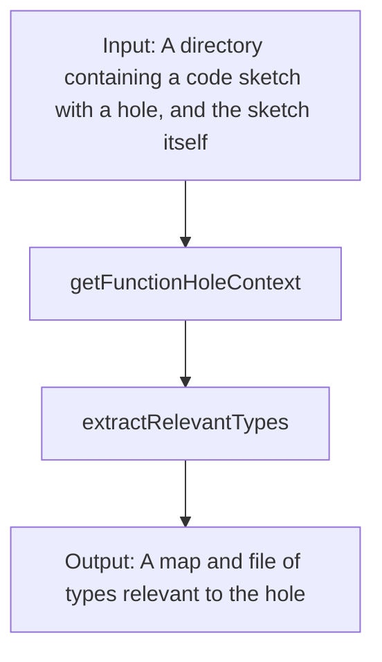

# testtslspclient

A project that aims to run `typescript-language-server` outside the scope of an editor.

## Installation

Install the following dependencies:

```text
npm install -g typescript-language-server typescript
```

Clone the `ts-lsp-client` repo:

```text
https://github.com/jpoly1219/ts-lsp-client
```

... and run these commands:

```text
cd ts-lsp-client
git checkout -b completion
git pull origin completion
npm install
npm run build
```

Clone this `testtslspclient` repo:

```text
https://github.com/jpoly1219/testtslspclient
```

... and run these commands:

```text
cd testtslspclient
npm install
```

## Running the code

Run the following command to start the program:

```text
node src/app.js <target directory with the code sketch> <code sketch file name>
```

Note that the target directory must be the full path. For example, if the target directory is in `~/testtslspclient/target/` and the code sketch file is `sketch.ts`, you would call the following:

```text
node src/app.js /home/<your username>/testtslspclient/target/<target-name>/ sketch.ts
```

The testrunner is run using the `run_tests.sh` script. Make sure to check the options inside the script before running.

```text
./run_tests.sh <your_run_name>
```

## Diagram

This is a top-level view of how data flows throughout the program.



We first try to see where the hole is located at. Then we detect the type of the hole.
Once we find the type of the hole, we use that to extract relevant types by recursively walking the type definitions in the given directory.

## How it works

`context-extractor` takes several steps to extract relevant types and headers:

1. Determine the type of the hole.
2. Extract relevant types.
3. Extract relevant headers.

### Determining the type of the hole

We use CodeQL to determine the type of the hole.
We denote `_()` to be the hole construct.
Using CodeQL, we find the AST node whose string representation includes `_()`.
Then we climb up the tree to find the enclosing statement, and its type annotation.
Note the term *type annotation*. CodeQL cannot infer the type of a given hole.
Every statement with a hole must include an explicit type annotation.
We are looking into ways to infer the type of the hole.

### Extracting relevant types

Once we have the type of the hole, we recursively extract types from its components.
For example, if the hole type includes `Model` and `Action`, we do the following:

- Visit those types.
- Get their definitions.
- Recurse on their components, until we reach primitive types.

In the end, we save all discovered relevant types into a map.

### Extracting relevant headers

This step follows that of the OOPSLA paper.
We find headers whose types are consistent with our target types.
The target types are as follows:

- The type of the hole itself. (Model, Action) => Model
- If the hole is a function, its return type.
- If the hole is a tuple, its component types.
- Recurse.

At this point, we have two different ways to check for consistency:

- Generate normal forms of both types and check whether they are the same.
- Use `tsc` to check if the following function compiles: `function check (a: HeaderType): TargetType { return a };`
- (possibly) Recursively extract types from headers. For each header, check if there are any common subsets between it's recursive types and target types. (possibly a faster normal form checker)

We use CodeQL to get all headers in the codebase, then sift through each one to extract the relevant ones.
We finally save these into a map.

## Limitations


